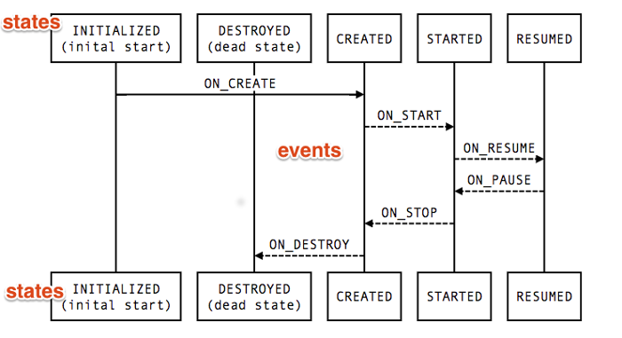
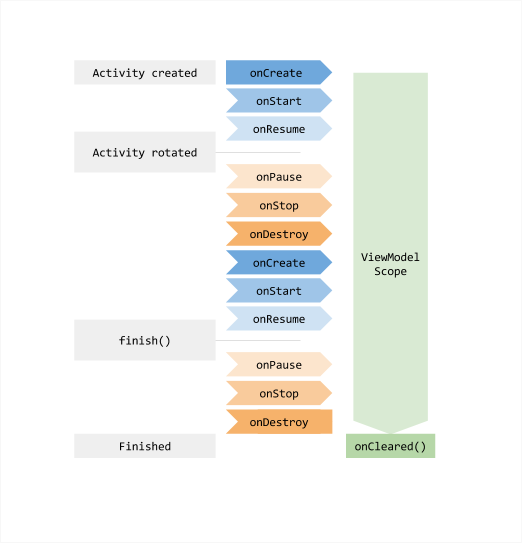
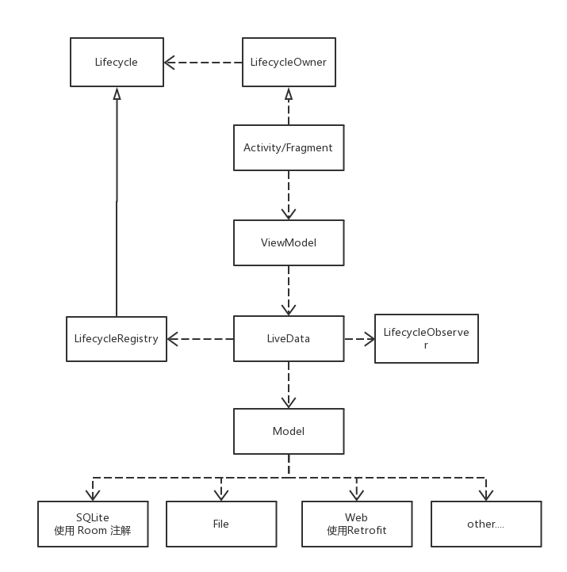
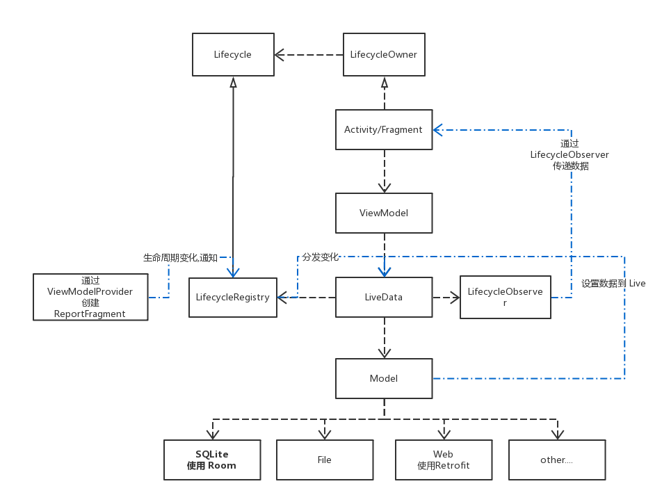

# 浅谈 Android Architecture Components 使用和原理


## 阅读
本文适合对 Android 开发,以及架构有一定了解的人阅读,实践性较强,最好结合项目运行了解.

本文阅读时长 20 ~ 30 分钟.

## 定义
```
A new collection of libraries that help you design robust,
testable, and maintainable apps.
Start with classes for managing your UI component lifecycle and
handling data persistence.
```
Android Architecture Components,简称 AAC,
意思就是一个处理 UI 的生命周期 与数据的持久化更加牛逼的架构

## 其他架构
我们比较熟悉的的架构有: MVC,MVP, 以及 MVVM.
关于这些架构的介绍网上有许多文章,这里不展开说明,对这些不是很熟悉的同学可以参考
[链接](http://www.jianshu.com/p/3010760035e0)

这些结构有各自的优缺点, 以现在比较流行的 MVP 为例, 它将不是关于界面的操作分发到 Presenter 中操作,再将结果通知给 View 接口的实现(通常是 Activity/Fragment).

### 存在问题
MVP 架构,当异步获取结果时,可能 UI 已经销毁,而 Presenter 还持有 UI 的引用,从而导致内存泄漏

```java
    @Override
    public void getName() {
        ExecutorServiceManager.getInstance().execute(new Runnable() {
            @Override
            public void run() {
                try {
                    TimeUnit.SECONDS.sleep(5);
                } catch (InterruptedException e) {
                    e.printStackTrace();
                }

                if (iView != null) {
                    iView.setName("siyehua");
                }
            }
        });
    }
```

以上代码, iView 的具体实现是 Activity, 当 Activity 已经执行了 onDestroy() 方法, 此时 Runnable 还在获取数据, 就会导致内存泄漏.

通常的做法是在给 Presenter 定义一个方法,当 Activity 销毁的时候同时移除对 iView 的引用,完整代码如下:

```java
public class PersonPresenter implements IPresenter {
    private IView iView;

    public PersonPresenter(IView iView) {
        this.iView = iView;
    }

    @Override
    public void getName() {
        ExecutorServiceManager.getInstance().execute(new Runnable() {
            @Override
            public void run() {
                try {
                    TimeUnit.SECONDS.sleep(5);
                } catch (InterruptedException e) {
                    e.printStackTrace();
                }

                if (iView != null) {
                    iView.setName("siyehua");
                }
            }
        });
    }

    public void removeView() {
        iView = null;
    }
}

```

在 Activity 中,代码调用如下:

```java
    @Override
    protected void onDestroy() {
        //不移除 View 有可能导致内存泄漏
        personPresenter.removeView();
        super.onDestroy();
    }
```

至此,即可解决 MVP 内存泄漏的问题,详细代码可看项目中的 [mvp](./app/src/java/com/example/siyehua/myanotation/mvp) 目录代码.

这么做不够优雅,需要手动管理 Presenter, 当然可以定义基类写入到 BaseActivity 中.

除了有可能引发内存泄漏的风险, 数据持久化也是一个经常困扰我们的问题.通常在屏幕旋转后, UI 的对象都会被销毁重建,这将导致原来的对象数据不得不重新创建和获取,浪费资源的同时也会影响用户的体验.

通常的解决方法是,通过 SavedInstanceState 来存取数据, 但 SavedInstanceState 存储的数据一般比较小,且数据对象还是必须重新构建.

### 使用 Android Architecture Components


上述两个问题可以通过使用 AAC 架构解决.

## 介绍
AAC 的核心是: Lifecycle, LiveData, ViewModel 以及 Room, 通过它可以非常优雅的让数据与界面交互,并做一些持久化的东西,高度解耦,自动管理生命周期, 而且不用担心内存泄漏的问题.


下面就一一介绍它们

### Lifecycle


Lifecycle 主要用 State 和 Event 这两个枚举类来表达 Activity/Fragment 的生命周期和状态. LifecycleRegistry 是它的主要实现类,用于分发生命周期的变化.

State 和 Event 之间的关系用下图表示:



### LiveData
LiveData 主要用于接受/更新数据, Lifecycle 的具体实现会将生命周期的变化传给 LiveData,LiveData 通过状态判断要不要刷新数据,假设要刷新数据,则通过 LifecycleObserver 将得到数据的变分发给对应的监听者(Activity/Fragment).

### ViewModel
用于管理数据,它持有 LiveData. 处理数据持久化,存取等具体逻辑, 相当于 MVP 中的 Presenter.



### Room
通过注解将数据持久化(数据库管理)


## 简单使用
### 配置
根目录gradle文件中添加Google Maven Repository

```
allprojects {
    repositories {
        jcenter()
        maven { url 'https://maven.google.com' }
    }
}
```


如使用Lifecycle, LiveData、ViewModel，添加如下依赖。

```
compile "android.arch.lifecycle:runtime:1.0.0-alpha1"
compile "android.arch.lifecycle:extensions:1.0.0-alpha1"
annotationProcessor "android.arch.lifecycle:compiler:1.0.0-alpha1"
```

如使用Room功能，添加如下依赖。

```
compile "android.arch.persistence.room:runtime:1.0.0-alpha1"
annotationProcessor "android.arch.persistence.room:compiler:1.0.0-alpha1"

// For testing Room migrations, add:
testCompile "android.arch.persistence.room:testing:1.0.0-alpha1"

// For Room RxJava support, add:
compile "android.arch.persistence.room:rxjava2:1.0.0-alpha1"

```

### 代码
Activity:

```java
public class Main4Activity extends LifecycleActivity {

    private Button btButton;

    @Override
    protected void onCreate(Bundle savedInstanceState) {
        super.onCreate(savedInstanceState);
        setContentView(R.layout.activity_main);
        btButton = (Button) findViewById(R.id.bt_click);

        UserViewModel userViewModel = ViewModelProviders.of(this).get(UserViewModel.class);
        userViewModel.getUserLiveData().observe(this, new Observer<User>() {
            @Override
            public void onChanged(@Nullable User user) {
                if (user != null) {
                    btButton.setText(user.getName());
                }
            }
        });
    }

}
```

其中 UserViewModel 的实现:

```java
public class UserViewModel extends ViewModel {
    private String id = "";
    private LiveData<User> userLiveData;

    public String getId() {
        return id;
    }

    public void setId(String id) {
        this.id = id;
    }

    public LiveData<User> getUserLiveData() {
        final MutableLiveData<User> data = new MutableLiveData<>();
        ExecutorServiceManager.getInstance().execute(new Runnable() {
            @Override
            public void run() {
                try {
                    TimeUnit.SECONDS.sleep(5);
                } catch (InterruptedException e) {
                    e.printStackTrace();
                }
                User user = new User();
                user.setName("siyehua");
                user.setPassword("123456");
                Log.e("siyehua", "child thread...");
                data.postValue(user);

            }
        });

        return userLiveData = data;
    }

    public void setUserLiveData(LiveData<User> userLiveData) {
        this.userLiveData = userLiveData;
    }
}
```


这样就完成了, LiveData 在 "data.postValue(user)" 后,获取到了 user 这个数据,分发到它的监听器,因为 Activity 监听了,所以 button 的 text 就自动改变了.

当 Activity 销毁了(本文所有的销毁,如果没有特别指明,指的都是 Activity 正常关闭,而不是其他因素导致的销毁重建),会自动将对应的 ViewModel 移除,这样就不会导致内存泄漏.同时,当 Activity 处于不可见的状态时,也不会去修改 UI.

关于代码的详细请看项目中的 [lifecycle](./app/src/java/com/example/siyehua/myanotation/lifecycle) 目录下的实现.

## 原理
讲原理之前先看一下这个架构的对应的 UML 类图,可以更好的帮助我们理解架构是怎样工作的



上文例子中,Activity 继承的是一个 LifecycleActivity,实际上它是 LifecycleOwner 的实现,这个接口的主要作用是返回一个 Lifecycle, 这个类前面介绍过了,它主要是作用是用来表达 UI 的 状态和过程,而 Lifecycle 的主要实现是 LifecycleRegistry.

```java
public class Main2Activity extends AppCompatActivity implements LifecycleRegistryOwner {

    //LifecycleFragment 与 LifecycleActivity 实际上的实现
    final LifecycleRegistry mRegistry = new LifecycleRegistry(new LifecycleOwner() {
        @Override
        public Lifecycle getLifecycle() {
            return getLifecycle();
        }
    });

    @Override
    public LifecycleRegistry getLifecycle() {
        return mRegistry;
    }
}
```

Activity 除了为 Lifecycle 提供生命周期的变化事件之外,它还持有 ViewModel 的引用, ViewModel 这个类在前面介绍过,主要是用来与 Activity 交互,处理数据,而它处理数据主要是通过 LiveData 来实现的.

LiveData 这个类根据之前的介绍,它主要是分发生命周期的事件,在上述代码,具体的实现是 MutableLiveData. 它持有 LifecycleRegistry(可监听/获取 UI 生命周期的状态), Model(具体的对象类 User), 以及 LifecycleObserver(观察者).

### 事件传递


架构的事件分两种,一种是 Activity/Fragment 的生命周期变化事件,还有一种是数据的变化事件.

### 生命周期变化分发过程
架构首先通过 APT 注解,在 AndroidManifest.xml 注册一个 LifecycleRuntimeTrojanProvider, 它是一个 ContentProvider, 用来管理初始化当前 Application 的监听进程.

可通过反编译 APK 包查看 AndroidManifest.xml 文件:

```xml
		<provider
			android:name="android.arch.lifecycle.LifecycleRuntimeTrojanProvider"
			android:exported="false"
			android:multiprocess="true"
			android:authorities="com.example.siyehua.myanotation.lifecycle-trojan"
			>
		</provider>
```


当创建 Activity 的时候, Application 会调用 dispatchActivityCreated() 方法:

```java
void dispatchActivityCreated(Activity activity, Bundle savedInstanceState) {
        Object[] callbacks = collectActivityLifecycleCallbacks();
        if (callbacks != null) {
            for (int i=0; i<callbacks.length; i++) {
                ((ActivityLifecycleCallbacks)callbacks[i]).onActivityCreated(activity,
                        savedInstanceState);
            }
        }
    }
```

因为 LifecycleRuntimeTrojanProvider 启动的时候,创建了一个 ActivityLifecycleCallbacks ,用来监听 Activity 的创建,当 Activity 创建的时候,就会通知到这个回调

回调会添加一个叫 ReportFragment 的碎片,用来监听 Activity 的生命周期, Lifecycle 之所以能感应 Activity 的生命周期,都是通过这个碎片传递的.

这个和 Glide 加载图片,自动检查生命周期的原理是一样的.

ReportFragment 的变化事件主要是通过 LifecycleRegistry 来表达的,而 LiveData 持有了 LifecycleRegistry,所以就获取到了生命周期的变化, LiveData 根据生命周期的状态,假设是销毁,就移除监听,假设是可见状态,就刷新数据,通过调用对应的观察者,从而实现了<b>生命周期变化</b>分发这个过程

### 数据变化事件分发过程


还是刚刚那个图,数据的变化事件更加简单, Model 得到了数据,通过 LiveData 的 postData() 方法设置数据, LiveData 的处理,之前已经说了, LiveData 根据生命周期的状态来决定要不要刷新数据,假设要刷新,就通知观察者刷新即可.

### ViewModel 的持久化


ViewModel 之所以能在 Activity/Fragment 重建的时候依旧能保持,主要是通过 ViewModelProviders 创建ViewModel,而不是 new 一个 ViewModel.

之前的代码:

```java
UserViewModel userViewModel = ViewModelProviders.of(this).get(UserViewModel.class);
```
ViewModelProviders 通过 ViewModelStore 来管理 ViewModel,
ViewModelStore 的一个 map 容器存储 ViewModel,通过 Activity 作为 key 区分,假设是同一个 Activity(哪怕不是同一个对象),就返回同一个 ViewModel, 直到 Activity 销毁则移除.

原理:通过给 Activity 添加一个,HolderFragment ,设置 setRetainInstance(true);(屏幕旋转时,保持数据的状态)


## 数据持久化之数据库 Room
数据的持久化是通过 Room 这个类库的注解来实现创建,以及增删改查,比较简单,详细可以看[官方文档](https://developer.android.com/topic/libraries/architecture/room.html)

```java
@Entity
public class User {
    @PrimaryKey
    private int uid;

    @ColumnInfo(name = "first_name")
    private String firstName;

    @ColumnInfo(name = "last_name")
    private String lastName;

    // Getters and setters are ignored for brevity,
    // but they're required for Room to work.
}
```


## AAC 的特点
* 数据驱动型编程:变化的永远是数据,界面无需更改.<br>我们通常的编程类型是:业务驱动型,即通过编写业务逻辑代码来实现,代码通常放在 Activity, 使用 MVP 之后放在 Presenter.<br><br>数据驱动型与业务驱动型最大的不同是:数据驱动型认为通常的变化大多是在数据层面上的变化,且它将数据的变化放在了数据层,<br>将 UI
的变化放在的 UI, 分离了变化,遵循"单一职责,一个类只有一个变化"的设计原则.<br>而业务驱动型的编程是根据业务的变化,修改获取到的数据,即获取到的数据还需要再根据业务需求处理一遍.

* 感知生命周期,防止内存泄漏<br>原理与 Glide 一样,通过给 Activity 添加一个碎片来监听生命周期的变化

* 高度解耦<br>数据,界面高度分离, library 分离,可仅使用其中一个功能,例如不使用数据库功能

* 数据持久化<br>数据 ViewModel 不与 UI 的生命周期挂钩,不会因为界面的重建而销毁

## 参考链接
[Android Architecture Components](https://developer.android.com/topic/libraries/architecture/index.html)


